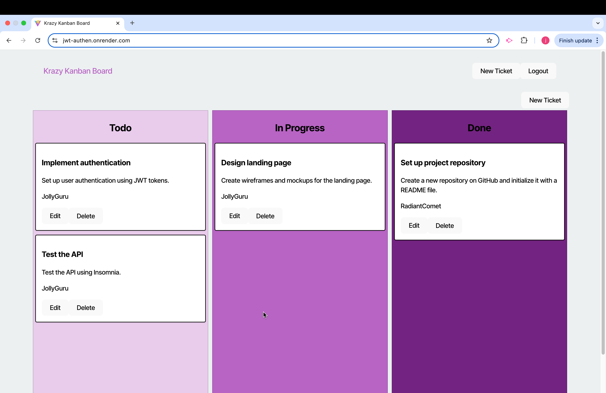
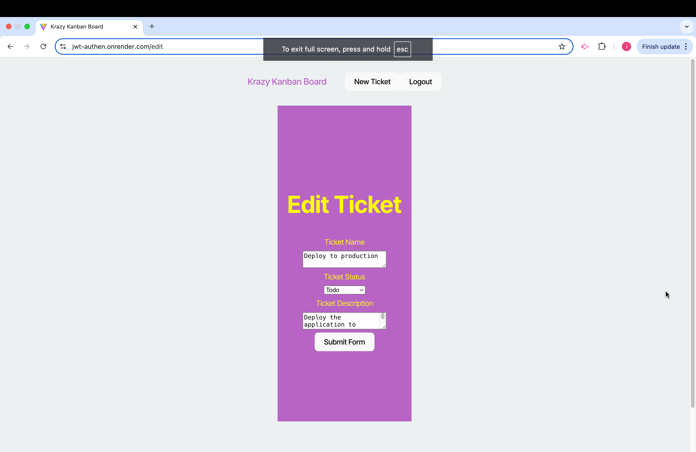

# **JWT-Authen**

## **Description**
This project implements a JSON Web Token (JWT)-based authentication system using Node.js, Express, and PostgreSQL. It provides secure routes for user registration, login, and access to protected resources. The project includes a robust database structure and seed files to populate initial data for testing and development.







---

## **Table of Contents**
- [Description](#description)
- [Features](#features)
- [Technologies Used](#technologies-used)
- [Installation](#installation)
- [Usage](#usage)
- [Database Schema](#database-schema)
- [Seeds](#seeds)
- [API Endpoints](#api-endpoints)
- [DeployWeb](#depolyweb)
- [License](#license)

---

## **Features**
- Secure user registration and login with hashed passwords.
- JWT-based authentication for route protection.
- Seed files to populate the database with initial data.
- Middleware for validating and decoding JWTs.
- Organized project structure for scalability and maintainability.

---

## **Technologies Used**
- **Backend**: Node.js, Express.js
- **Database**: PostgreSQL
- **ORM**: Sequelize
- **Authentication**: JSON Web Tokens (JWT)
- **Tools**: pgAdmin, Insomnia/Postman for API testing
- **Programming Language**: TypeScript

---

## **Installation**

### Prerequisites
- Node.js (v16+ recommended)
- PostgreSQL
- npm or yarn package manager

### Steps
1. Clone the repository:
   ```bash
   git clone <repository_url>
   cd <repository_name>
   ```
2. Install dependencies:

    ```bash
    npm install
    ```

3. Set up the database:

	•	Use pgAdmin or your preferred tool to create a PostgreSQL database.

	•	Run the schema script to create the necessary tables:

    ```bash
    psql -U <username> -d <database_name> -f server/db/schema.sql
    ```

4. Configure environment variables:
	•	Create a .env file in the root directory and add the following:

    ```bash
    DDB_USER=<your_database_username>
    DB_PASSWORD=<your_database_password>
    DB_NAME=kanban_db
    DB_HOST=localhost
    JWT_SECRET=<your_secret_key>
    ```

5. Compile TypeScript files:

    ```bash
    npm run build
    ```

6. Seed the database:

    ```bash
    npm run seed
    ```

7. Start the server:

    ```bash
    npm run start
    ```

---
## **Usage**

1. Start the server using:

    ```bash
    npm run start
    ```
2.	Test API routes using Insomnia or Postman:

	•	Register a User: POST /api/users/register

	•	Login: POST /api/users/login

	•	Access Protected Route: GET /api/protected

---
## **Database Schema**

•	**Users** Table:

	•	id (Primary Key)

	•	username (Unique)

	•	password (Hashed)

•	**Tickets** Table:

	•	id (Primary Key)

	•	name (String)

	•	status (String)

	•	description (String)

	•	assignedUserId (Foreign Key referencing Users.id)


---
## **Seeds**

•**User Seeds**:

Populates initial users into the users table with hashed passwords.

```bash
await User.bulkCreate([
  { username: 'JollyGuru', password: 'password' },
  { username: 'SunnyScribe', password: 'password' },
  { username: 'RadiantComet', password: 'password' },
]);
```

•**Tickets Seeds**:

```bash
await Ticket.bulkCreate([
  { name: 'Design landing page', status: 'In Progress', assignedUserId: 1 },
  { name: 'Set up project repository', status: 'Done', assignedUserId: 2 },
]);
```

 ---
## **API Endpoint**

**User Authentication**

	•	POST /api/users/register

	•	Registers a new user.

	•	Required fields: username, password.

	•	POST /api/users/login

	•	Authenticates a user and returns a JWT token.

	•	Required fields: username, password.

**Tickets**

	•	GET /api/tickets

	•	Fetches all tickets (protected route).

	•	POST /api/tickets

	•	Creates a new ticket (protected route).

	•	Required fields: name, status, description.


---
## **DeployWeb**

Render Live Web Site: https://jwt-authen.onrender.com


---
## **License**

This project is licensed under the MIT License. See the LICENSE file for more details.